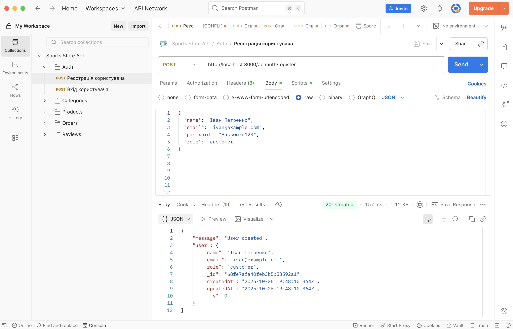

# Звіт з лабораторної роботи 1

## Тема роботи: Розроблення backend архітектури та основного функціоналу

Здобувач освіти: Данилюк Сергій
Група: ІПЗ-41
GitHub репозиторій: [посилання]

## Виконання роботи

### Налаштування проєкту
- Створено Git репозиторій
- Ініціалізовано Node.js проєкт
- Встановлено необхідні залежності (Express, Mongoose, dotenv, bcrypt, jsonwebtoken тощо)
- Налаштовано структуру файлів і папок

### База даних
- Налаштовано MongoDB та підключення через `.env`
- Створено схеми Mongoose для моделей: User, Category, Product, Order, Review
- Реалізовано підключення до бази даних у `src/app.js`

### Backend архітектура
- Створено Express.js сервер (`src/app.js`)
- Реалізовано MVC архітектуру (контролери, моделі, маршрути)
- Впроваджено middleware для обробки запитів, валідації даних та помилок

### API endpoints

#### Auth
- POST /api/auth/register — реєстрація користувача  
- POST /api/auth/login — логін користувача  

#### Categories
- POST /api/categories — створити категорію  
- GET /api/categories — отримати всі категорії  
- PUT /api/categories/:id — оновити категорію  
- DELETE /api/categories/:id — видалити категорію  

#### Products
- POST /api/products — створити продукт  
- GET /api/products — отримати всі продукти  
- GET /api/products/:id — отримати продукт за ID  
- PUT /api/products/:id — оновити продукт  
- DELETE /api/products/:id — видалити продукт  

#### Orders
- POST /api/orders — створити замовлення  
- GET /api/orders — отримати всі замовлення  
- GET /api/orders/:id — отримати замовлення за ID  
- PUT /api/orders/:id — оновити замовлення  
- DELETE /api/orders/:id — видалити замовлення  

#### Reviews
- POST /api/reviews — створити відгук  
- GET /api/reviews — отримати всі відгуки  
- PUT /api/reviews/:id — оновити відгук  
- DELETE /api/reviews/:id — видалити відгук

## Структура проєкту

```
sport-store/
├── src/
│   ├── controllers/
│   │   ├── authController.js
│   │   ├── categoryController.js
│   │   ├── orderController.js
│   │   ├── productController.js
│   │   └── reviewController.js
│   │
│   ├── middleware/
│   │   └── errorHandler.js
│   │
│   ├── models/
│   │   ├── Category.js
│   │   ├── Order.js
│   │   ├── Product.js
│   │   ├── Review.js
│   │   └── User.js
│   │
│   ├── routes/
│   │   ├── auth.js
│   │   ├── categories.js
│   │   ├── orders.js
│   │   ├── products.js
│   │   └── reviews.js
│   │
│   ├── utils/
│   │   └── hashPassword.js
│   │
│   └── app.js
│
├── reports/
│   └── lab1-report.md
│
├── .env
├── .gitignore
├── API_DOCUMENTATION.md
├── package.json
├── package-lock.json
└── README.md
```

## Скріншоти тестування



## Висновки

Самооцінка: 5   

Обгрунтування: виконано всі завдання лабораторної роботи, реалізована повна валідація даних та обробка помилок, налаштовано підключення до MongoDB та створена документація API.
